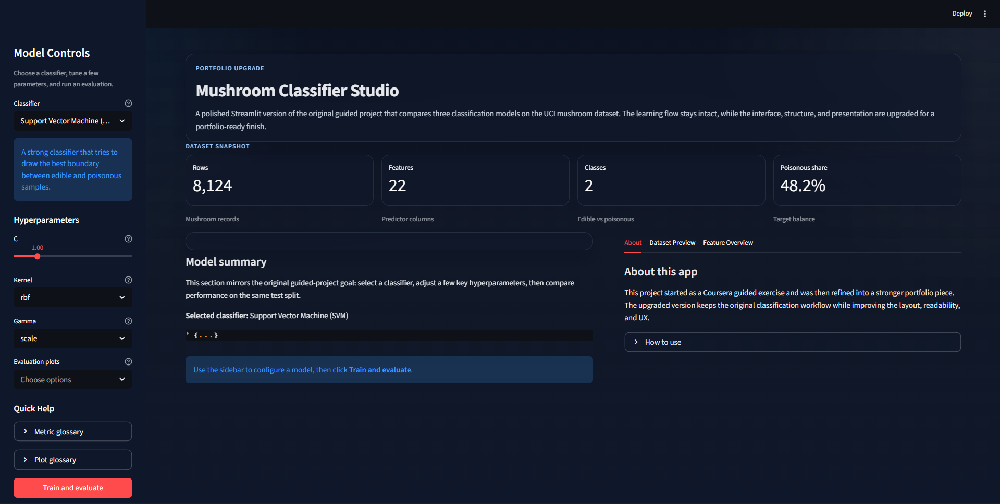
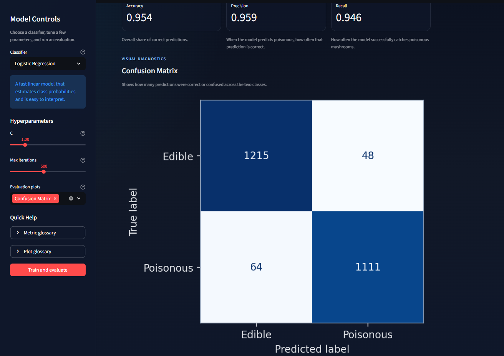
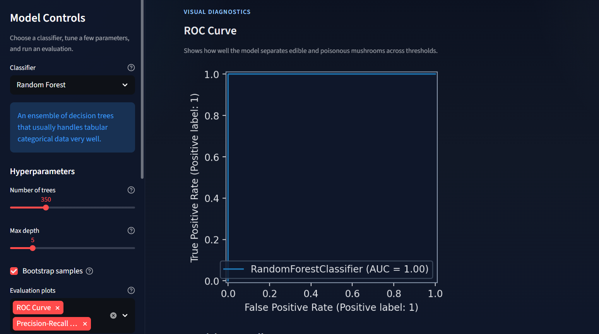
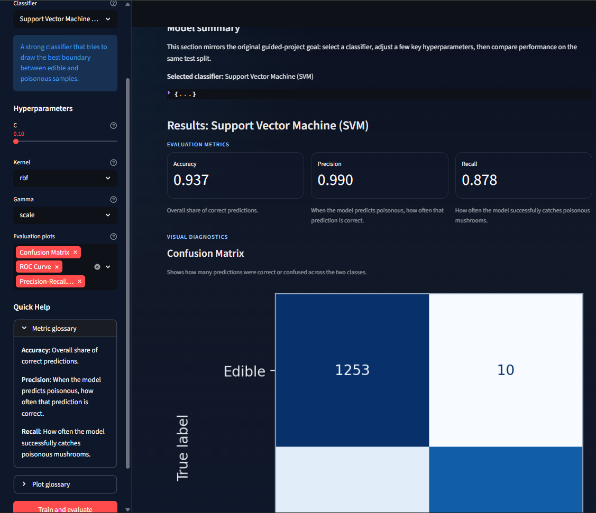

# Mushroom Classifier Studio

A portfolio-ready Streamlit machine learning app based on the Coursera guided project **"Build a Machine Learning Web App with Streamlit and Python."**

This upgraded version keeps the original learning objective intact while improving the code structure, interface design, documentation, and overall presentation. The result is a cleaner and more professional project for GitHub, LinkedIn, CV, and freelance portfolio use.

## Overview

The app uses the mushroom classification dataset to compare three supervised learning models:

- Support Vector Machine (SVM)
- Logistic Regression
- Random Forest

Users can:

- choose a classifier
- adjust relevant hyperparameters
- train and evaluate the model
- review key metrics
- inspect confusion matrix, ROC, and precision-recall plots

## Why This Project Stands Out

- Preserves the original guided-project logic for honest before-and-after comparison
- Presents the workflow in a cleaner dark-themed UI with stronger hierarchy and spacing
- Adds practical help text for classifiers, hyperparameters, metrics, and plots
- Organizes the code more clearly for readability and maintenance
- Feels like a thoughtful student portfolio project rather than a raw tutorial upload

## Features

- Dark-mode Streamlit interface with subtle visual polish
- Sidebar-based classifier selection and parameter tuning
- Compact hover help using native Streamlit widget help text
- Stable cached dataset loading and structured train/evaluate flow
- `st.metric` cards for accuracy, precision, and recall
- Visual diagnostics for confusion matrix, ROC curve, and precision-recall curve
- Dataset preview and feature overview sections
- Preserved baseline implementation in `base_app.py`

## Tech Stack

- Python
- Streamlit
- Pandas
- scikit-learn
- Matplotlib

## Screenshots

### Home and Controls



### Model Evaluation





### Sidebar and Tuning Panel



## Project Structure

```text
streamlit-ml-classifier-app/
|-- app.py
|-- base_app.py
|-- mushrooms.csv
|-- requirements.txt
|-- README.md
|-- .gitignore
|-- LICENSE
`-- assets/
    `-- screenshots/
```

## Guided Project vs Enhancement

### Original Guided Project

- Loaded the mushroom dataset
- Let the user choose a classifier
- Included basic hyperparameter controls
- Split the data into training and testing sets
- Reported accuracy, precision, and recall
- Displayed confusion matrix, ROC curve, and precision-recall curve

### Portfolio Enhancements Added

- Rebuilt the app with a cleaner layout and more polished dark theme
- Improved code organization with reusable functions and clearer naming
- Added better sectioning, summary cards, and main/sidebar flow
- Updated plotting and presentation for a more professional visual result
- Added concise help text throughout the interface
- Improved repository structure, README quality, and licensing

## Setup

### 1. Clone the repository

```bash
git clone https://github.com/OmarNayyar/streamlit-ml-classifier-app.git
cd streamlit-ml-classifier-app
```

### 2. Create and activate a virtual environment

Windows PowerShell:

```powershell
python -m venv .venv
.venv\Scripts\Activate.ps1
```

### 3. Install dependencies

```bash
pip install -r requirements.txt
```

## Run Locally

```bash
streamlit run app.py
```

Then open the local Streamlit URL shown in your terminal.

## Future Improvements

- Add optional cross-validation mode
- Add a lightweight multi-model comparison summary
- Add exportable experiment results
- Deploy the app on Streamlit Community Cloud

## Author

**Omar Nayyar**  
Machine learning and software portfolio project built from an original Coursera guided exercise.

## License

This project is licensed under the MIT License. See [LICENSE](LICENSE) for details.
